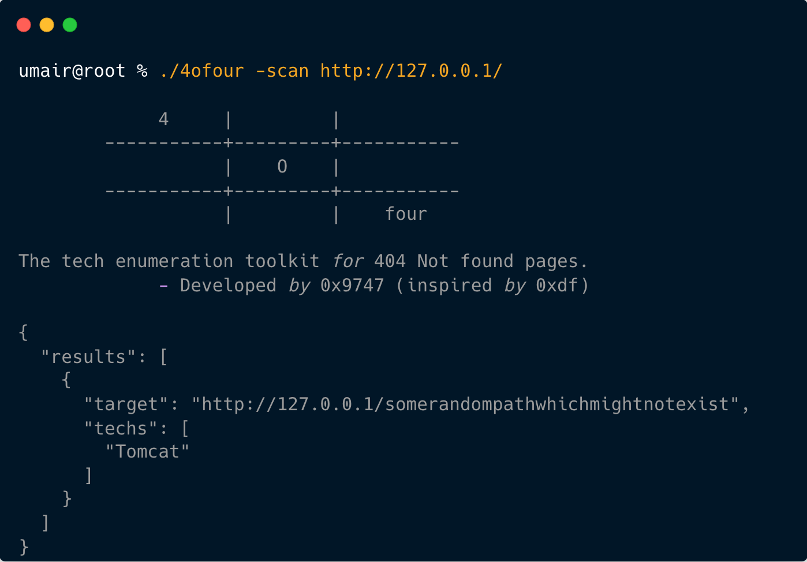

<h1 align="center">4oFour</h1>
<p align="center"><b>A tech enumeration toolkit for 404 Not found pages.</b></p>
<p align="center">
<a href="#description">Description</a> • <a href="#features">Features</a> • <a href="docs/documentation.md">Documentation</a> • <a href="#contactme">Contact Me</a><br><br>

  <a href="https://www.buymeacoffee.com/umair9747" target="_blank"></a>
</p>
<hr>

<br>
<div id="description">
<h2> Description </h2>
4oFour is a command-line utility tool written in Go that helps enumerate technology stacks used by a target based on the unique 404 error pages they generate. By analyzing these error pages, 4oFour can identify key tech signatures and provide insights into the underlying infrastructure of a target system.

The tool currently supports the detection of 18 distinct technology signatures, with plans to expand support to additional technologies in future updates. 4oFour is designed for fast, automated tech stack discovery, offering an efficient way to gain valuable information about a target's environment.
</div>
<hr style="height: 1px;">

<div id="features">
<h2> Features </h2>

<h4>Tech Stack Enumeration</h4>
4oFour analyzes 404 error pages to identify the technologies running on a target system. With support for 18 distinct tech signatures, it provides a detailed overview of the stack based solely on error page characteristics.

<h4>Automated Detection</h4>
Simply input a target URL, and 4oFour will automatically scan for 404 error pages and detect recognizable patterns that reveal technology components, allowing for quick and efficient enumeration of tech stacks.

<h4>Signature Expansion</h4>
4oFour's detection capabilities are regularly updated. While it currently supports 18 tech signatures, the tool is designed to evolve with more signatures added soon, ensuring broad coverage of common and emerging technologies.
</div>

<hr style="height: 1px;">

<div id="installation">
<h2> Installation </h2>
You can install Seize by cloning the repository and building it manually using the following steps (Make sure to have <a href="https://go.dev/doc/install">Go</a> installed on your system):<br>


```bash
git clone https://github.com/umair9747/4oFour.git
cd 4oFour
go build
```
</div>

<hr style="height: 1px;">

<div id="contactme">
<h2> Contact Me </h2>
Have any suggestions, queries, feedback or just want to connect with me? Feel free to reach out using the below handles:
<ul type="disc">
<li><a href="https://www.linkedin.com/in/umair-nehri-49699317a">LinkedIn</a></li>
<li><a href="https://twitter.com/0x9747/">Twitter / X</a></li>
</ul>

Also, if you'd like to support me for my future research works, please consider using <a href="https://www.buymeacoffee.com/umair9747">this link</a> for your donations!
</div>
